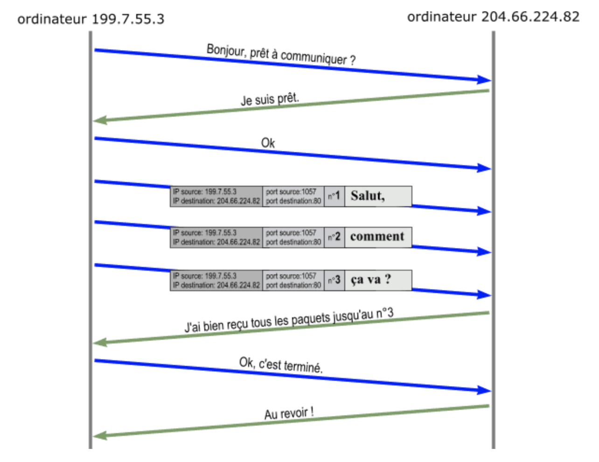

# TCP

> TCP/IP permet de communiquer de façon fiable entre logiciels situés sur des ordinateurs différents.

En effet lorsque vous envoyez un paquet IP sur Internet, il passe par une multitude d'ordinateurs avant d'arriver à l'ordinateur cible.

Malheureusement il y a quelques problèmes:

- Il arrive que des paquets IP se perdent ou arrivent en double exemplaire.
- Nous ne pouvont pas savoir si le paquet est bien arrivé à destination
- La taille des paquets IP est limitée (environ 1500 octets)

C'est pour répondre à ces problématique que TCP à été conçu, TCP est capable de:

- faire tout ce que UDP sait faire
- vérifier que le destinataire est prêt à recevoir les données
- découper les gros paquets de données en paquets plus petits pour que IP les accepte
- numéroter les paquets afin de vérifier à la réception qu'ils sont tous bien arrivés, de redemander les paquets manquants et de les réassembler avant de les donner aux logiciels.

A l'arrivée, sur l'ordinateur 204.66.224.82, la couche TCP reconstitue le message "Salut, comment ça va ?" à partir des 3 paquets IP reçus et le donne au logiciel qui est sur le port 80.

Avec TCP/IP, on peut maintenant communiquer de façon fiable entre logiciels situés sur des ordinateurs différents.

TCP/IP est utilisé pour des tas de choses:

- Dans votre navigateur, le protocole HTTP utilise le protocole TCP/IP pour envoyer et recevoir des pages HTML, des images GIF, JPG et toutes sortes d'autres données.
  FTP est un protocole qui permet d'envoyer et recevoir des fichiers. Il utilise également TCP/IP.
- Votre logiciel de courrier électronique utilise les protocoles SMTP et POP3 pour envoyer et recevoir des emails. SMTP et POP3 utilisent eux aussi TCP/IP.
- Votre navigateur (et d'autres logiciels) utilisent le protocole DNS pour trouver l'adresse IP d'un ordinateur à partir de son nom (par exemple, de trouver 216.32.74.52 à partir de 'www.yahoo.com'). Le protocole DNS utilise UDP/IP et TCP/IP en fonction de ses besoins.

L'avantage de TCP sur UDP est que TCP permet des communications fiables. L'inconvénient est qu'il nécessite une négociation, ce qui prend du temps.
