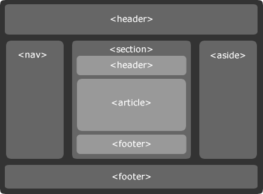

# Balises universelles

> block : les balises ouvrante et fermante produisent un retour à la ligne  
> inline : ces balises se trouvent à l’intérieur de balises block et ne produisent pas de retour à la ligne.

| Balise | Description |
| ------ | ----------- |
| div    | block       |
| span   | inline      |

Les balises universelles n'ont pas de portée sémantique, elles sont reservée à la mise en forme. Les balises `
`, `
` et `` pourraient suffire à structurer et mettre en forme une page (en conjonction avec les attributs id, class ou style et le langage CSS). Mais autant essayer de prendre de bonnes habitudes en utilisant également les balises
sémantiques pour tirer tout le potentiel des navigateurs ou des moteurs de recherche.

# Balises structurantes de la page

| Balise  | Description         |
| ------- | ------------------- |
| header  | en-tête             |
| nav     | liens de navigation |
| main    | contenu majoritaire |
| section | contenu thématique  |
| article | contenu autonome    |
| aside   | contenu indirect    |
| footer  | pied de page        |

# Balises structurantes du texte

> Les différent niveau d'importance sont important pour le référencement pour donner du poids à un titre ou à un mot.

| Balise     | Description                                           |
| ---------- | ----------------------------------------------------- |
| h1         | titre de niveau le plus important                     |
| h2         | titre de niveau moins important                       |
| ...        | ...                                                   |
| h6         | titre de niveau le moins important                    |
| p          | paragraphe                                            |
| mark       | portion de texte marquée                              |
| em         | portion de texte qui doit être mit en avant           |
| strong     | portion de texte qui doit être fortement mit en avant |
| blockquote | citation longue                                       |
| cite       | citation moyenne                                      |
| q          | citation courte                                       |
| dfn        | terme à définir                                       |
| abbr       | abréviation                                           |
| sup        | exposant                                              |
| sub        | indice                                                |
| time       | date et/ou délai                                      |
| etc...     |                                                       |

# Les balises de liste

| Balise | Description        |
| ------ | ------------------ |
| ul     | liste non ordonnée |
| ol     | liste ordonnée     |
| li     | élément de liste   |

> exemple de structure html

