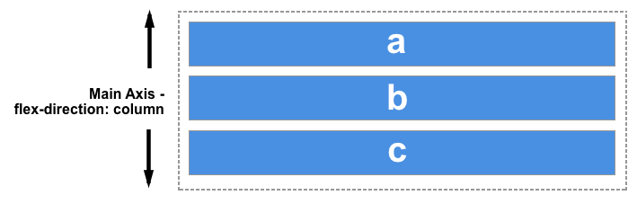

# Positionnement

- Les éléments se positionnent dans le l'ordre du code HTML
- Chaque élément à une position déterminée
- Attribut position
  - Static: flux standard (par défaut)
  - Relative: positionnement par rapport à la position normale dans le flux standard
  - Absolute: positionnement indépendant dans la page par rapport au parent relative le plus proche
  - Fixed: positionnement indépendant dans la fenêtre
- Positionnement
  - top, left, bottom, right
- float
  - Permet de mettre un élément en mode flottant à gauche ou à droite
- z-index
  - Régle la profondeur

# flex

> Le module des boîtes flexibles, aussi appelé « flexbox », a été conçu comme un modèle de disposition unidimensionnel et comme une méthode permettant de distribuer l'espace entre des objets d'une interface ainsi que de les aligner.

### L'axe principal

L'axe principal est défini par la propriété flex-direction qui peut prendre quatre valeurs :

- row
- row-reverse
- column
- column-reverse

row :

column :

### L'axe secondaire

L'axe secondaire est perpendiculaire à l'axe principal. Ainsi, si flex-direction vaut row ou row-reverse, l'axe secondaire suivra l'axe des colonnes.

row :

column :

